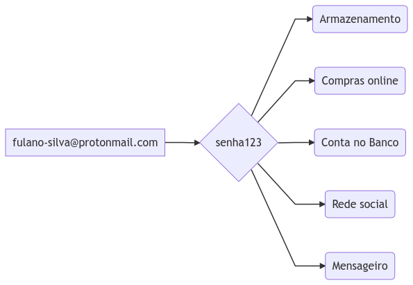
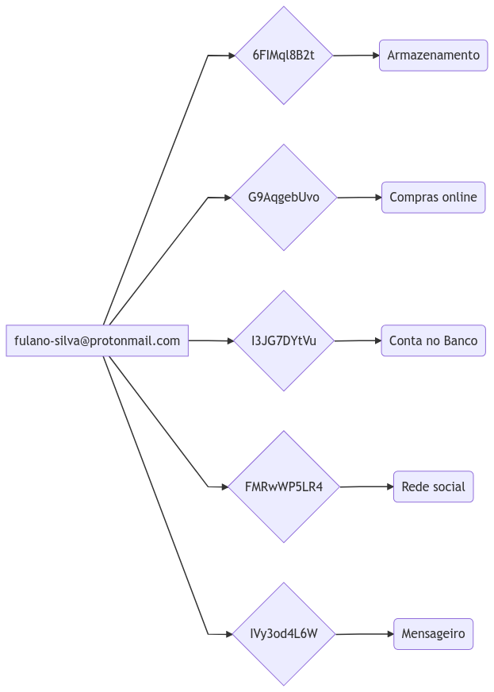
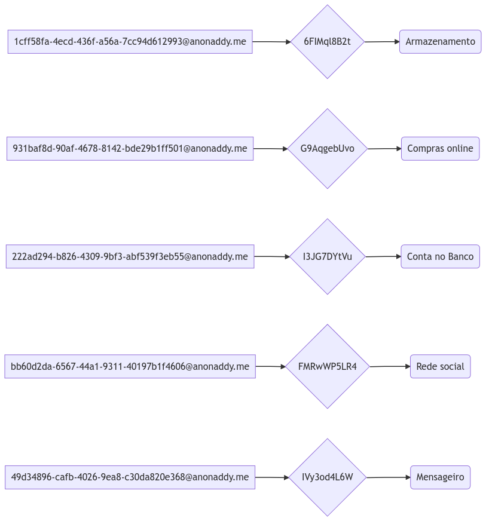

    ---
    layout: post
    title: Compartimentação: o princípio mais importante para privacidade e segurança digital
    ---

O advento da maior crise de saúde pública do século XXI trouxe consigo a
necessidade de nos isolarmos fisicamente uns dos outros, movendo todos
os aspectos de nossas vidas pessoais, acadêmicas e profissionais para o
âmbito virtual. Essa diáspora digital tornou essencial o aprendizado de
boas práticas de privacidade e segurança na internet, sendo a principal
delas o tema desse texto: Compartimentação.

Em resumo, o princípio da compartimentação consiste em decentralizar o
acesso aos seus registros eletrônicos. Uma maneira simples de visualizar
esse conceito é imaginando os compartimentos como “caixas”, nas quais
você organiza diferentes aspectos da sua vida digital. Por exemplo, você
pode ter “caixas” diferentes para atividades pessoais, acadêmicas e
profisionais. Assim, se a “caixa de atividades pessoais” for
comprometida, a sua vida profissional e a sua vida acadêmica mantêm-se
intactas. Entedido isso, vamos ver como colocar a compartimentaćão em
prática!

Vale relembrar aqui que eu não sou um especialista em segurança, e
mantenho esse blog apenas como *hobbie*. Se você considera que está em
uma situação de alto risco, é recomendada a consultoria de um
profissional.

Compartimentação de Serviços
----------------------------

Por maior que seja a conveniência fornecida pelos serviços do Google, o
uso dos mesmo não é muito atrativo do ponto de vista da privacidade.
Isto, pois uma única conta acumula dados de diversos frontes de nossas
vidas como mostra a tabela abaixo:

| Serviço                | Produto          | Provedor | Dados Coletados                |
|------------------------|------------------|----------|--------------------------------|
| Pesquisa na Internet   | Google Search    | Google   | Seus interesses                |
| Navegação              | Google Maps      | Google   | Sua localização                |
| Armazenamento na nuvem | Google Drive     | Google   | Seus documentos                |
| Sincronização de fotos | Google Photos    | Google   | Seu rosto                      |
| Loja de aplicativos    | Play Store       | Google   | Seus aplicativos               |
| Sistema operacional    | Android          | Google   | Seus hábitos de uso do celular |
| Vídeos online          | YouTube          | Google   | Suas preferências de mídia     |
| Conferência de vídeo   | Meets e Hangouts | Google   | Sua voz e seus manerismos      |
| Email                  | Gmail            | Google   | Suas incrições em serviços     |
| Calendário             | Google Calendar  | Google   | Sua rotina e seus eventos      |

A ubiquidade de uma única empresa em todas as suas atividades digitais
permite que a mesma agregue quantidades obcenas de informação sobre
você. Por mais que a informação coletada por um único serviço pareça
inofensiva a primeira vista (ex: “suas prefências de mídia” coletadas
pelo YouTube), a verdade é que, nesse caso, o todo é maior que a soma
das partes. A combinação de tais permite a elaboração de um modelo
extremamente sofisticado e preciso para prever todos os aspectos de sua
vida, o que constitui uma tremenda invasão de privacidade.

Além disso, todos esses serviços são vinculados a uma única Conta
Google. Isso significa que basta a um hacker invadir essa conta para se
apossar indevidamente de todas as informações mencionadas na tabela.
Outra desvantagem da centralização de serviços é a dificuldade que se
cria para trocar de provedor e testar novidades que possivelmente
atenderiam melhor às suas necessidades.

Em vista disso, eu recomendo o uso de serviços que sejam oferecidos por
empresas diferentes, que não compartilham dados entre si (ou, nos
melhores casos, nem sequer coletam seus dados!). Isso isola (ou seja
*compartimentaliza*) sua atividade online, oferecendo significativo grau
de proteção a sua privacidade. A seguir estão listados alguns serviços
que cumprem tais requerimentos. Se quiser testá-los, basta clicar no
nome deles!

<table>
<colgroup>
<col style="width: 13%" />
<col style="width: 35%" />
<col style="width: 15%" />
<col style="width: 35%" />
</colgroup>
<thead>
<tr class="header">
<th>Serviço</th>
<th>Produto</th>
<th>Provedor</th>
<th>Dados Coletados</th>
</tr>
</thead>
<tbody>
<tr class="odd">
<td>Pesquisa na internet</td>
<td><a href="https://duckduckgo.com/">DuckDuckGo</a></td>
<td>DuckDuckGo Inc.</td>
<td>Nenhum (apenas suas configurações, caso você queira)</td>
</tr>
<tr class="even">
<td>Navegação</td>
<td><a href="https://www.openstreetmap.org">Open Street Maps</a></td>
<td>Open Street Maps Foundation</td>
<td>Nenhum ou apenas o necessário para criar uma conta, caso você queira</td>
</tr>
<tr class="odd">
<td>Armazenamento na nuvem</td>
<td><a href="https://cryptpad.fr">CryptPad</a></td>
<td>XWiki</td>
<td>Apenas o necessário para criar uma conta (os documentos em si são encriptados de ponta a ponta)</td>
</tr>
<tr class="even">
<td>Sincronização de fotos</td>
<td><a href="https://syncthing.net/">Syncthing</a></td>
<td>Syncthing Community</td>
<td>Nenhum</td>
</tr>
<tr class="odd">
<td>Loja de aplicativos</td>
<td><a href="https://auroraoss.com/">Aurora Store</a></td>
<td>Aurora Open Source Software</td>
<td>Nenhum</td>
</tr>
<tr class="even">
<td>Sistema operacional</td>
<td><a href="https://freerobot.org/">CalyxOS</a></td>
<td>Calyx Institute</td>
<td>Nenhum</td>
</tr>
<tr class="odd">
<td>Vídeos online</td>
<td><a href="https://invidious.snopyta.org/">Invidious</a></td>
<td>Invidious Community</td>
<td>Nenhum ou apenas o necessário para criar uma conta, caso você queira</td>
</tr>
<tr class="even">
<td>Conferência de vídeo</td>
<td><a href="https://jami.net/">Jami</a></td>
<td>Savoir-Faire Linux</td>
<td>Nenhum</td>
</tr>
<tr class="odd">
<td>Email</td>
<td><a href="https://protonmail.com/">Protonmail</a></td>
<td>Proton Technologies Ltd.</td>
<td>Apenas o necessário para criar uma conta (os emails em si são encriptados de ponta a ponta)</td>
</tr>
<tr class="even">
<td>Calendário</td>
<td><a href="https://play.google.com/store/apps/details?id=ws.xsoh.etar">Etar</a></td>
<td>Etar Group</td>
<td>Nenhum</td>
</tr>
</tbody>
</table>

Dos serviços acima, minha mais fortes recomendações são DuckDuckGo e
Protonmail. Eles não só oferecem serviços mais justos e menos invasivos
que os serviços do Google, como também oferecem, na minha opinião,
serviços melhores.

Compartimentação de Credenciais
-------------------------------

